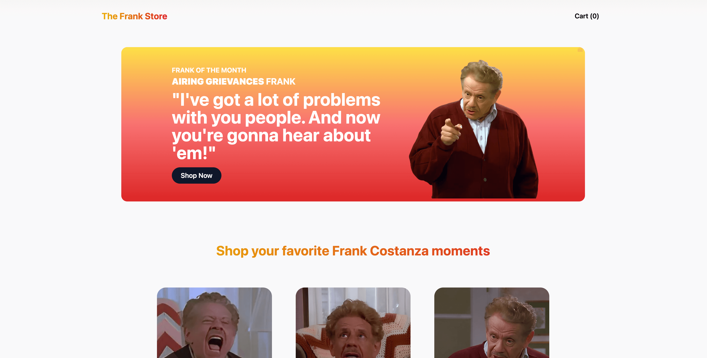

# The Frank Store

The Frank Store is an e-commerce web app designed exclusively for devoted Frank Costanza fans to browse and purchase from a collection of digital photos capturing his classic moments.

## Table of contents

- [Introduction](#introduction)
- [Technology](#technology)
- [Features](#features)
- [Roadmap](#roadmap)
- [Visit LessonCollab](#visit-lessoncollab)
- [Let's Connect](#lets-connect)

## Introduction

With Next.js (React) at its core, **The Frank Store** provides a smooth and intuitive user interface, ensuring effortless navigation through a catalog of Frank Costanza images. The integration of Sanity's headless CMS enables curation of a diverse range of high-quality, nostalgia-boosting photos showcasing the very best of Frank Costanza's comedic moments.

By incorporating Stripe custom checkout, **The Frank Store** is built to prioritize secure transactions.

## Technology

### Next.js

- Next.js is a versatile React framework that powers **The Frank Store**, enabling a seamless and performant user experience. With Next.js, **The Frank Store** benefits from efficient rendering, server-side rendering capabilities, and dynamic routing.

### React Context

- React Context is used for app state management. Through the context provider, we enable all child components to leverage functions that manage cart items, manipulate item quantity, and incorporate discount coupons at checkout.

### Sanity Headless CMS

- With Sanity, there are schemas for the home page banner, which episode the Frank moment is from, and all other Frank details:

### Stripe

- Stripe is used for a custom checkout experience.

## Features

### React Hot Toast

- [React Hot Toast](https://react-hot-toast.com/) is used for a great package for leveraging toast style app notifications. I deployed them here to handle notifications based on cart changes.

## Live Demo

[Visit The Frank Store today!](https://the-frank-store.vercel.app/)

## Let's Connect

- [Follow me on Twitter](https://twitter.com/_internetdrew)
- [Let's connect on LinkedIn](https://www.linkedin.com/in/internetdrew/)
